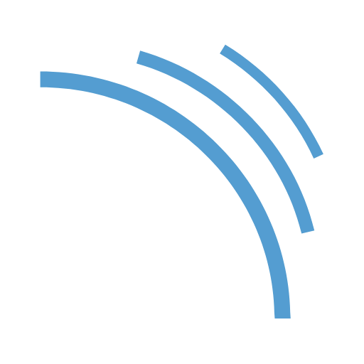

## DevSecOps Jenkins CI/CD Pipeline on AWS
> Secure-by-Design CI/CD Framework with Real-Time Scanning & Cloud Deployment.

A production-grade DevSecOps pipeline engineered with Jenkins and Docker to enforce secure coding, automated testing, and container security across every stage of the SDLC. This framework integrates SonarQube, OWASP Dependency-Check, Trivy, and Docker to deliver continuous visibility, real-time threat detection, and automated containerized deployment to AWS EC2. Built for scalability, auditability, and alignment with modern enterprise security standards.

<p align="center">
  
  
</p>

<br/>

<p align="center">
  <!-- Jenkins -->
  
  
  <!-- AWS -->
  

  <!-- SonarQube -->
  

  <!-- OWASP Dependency Check -->
  

  <!-- Trivy -->
  

  

</p>

## Tools Used
<p align="center">        </p>

## Architecture Diagram

<p align="center">
  
</p>

<p align="center"><i>Secure-by-Design DevSecOps CI/CD Workflow using Jenkins, SonarQube, Trivy & AWS</i></p>

## Phases

Step | Description
--- | ---
DevSecOps Integration | Integrated security into every stage of CI/CD with Jenkins, Docker, SonarQube, OWASP, and Trivy.
Set up Jenkins | Installed and configured Jenkins on an AWS EC2 instance.
Build with Docker | Containerized the application for consistent builds and deployment.
Integrated SonarQube | Set up code quality checks and static analysis during builds.
Added OWASP Dependency-Check | Automated open-source vulnerability scanning during the build phase.
Integrated Trivy | Performed container image vulnerability scans post-Docker build.
Deployed to AWS EC2 | Final deployment done via automated scripts to AWS infrastructure.

## Repo Layout
```
devsecops-ci-cd-pipeline-with-jenkins/
│
├── 01-architecture/
│   └── devsecops-architecture.png
│
├── 02-pipeline-script/
│   └── Jenkinsfile
│
├── 03-screenshots/
│   └── *.png
│
├── 04-icons/
│   └── *.png
```
## Visual Walkthrough

View the 03-screenshots/ folder for more details and visuals of the pipeline in action.

## Reach Out At!!

Noufa Sunkesula

Email ID: noufasunkesula@gmail.com

Contact: +91 8106859686
